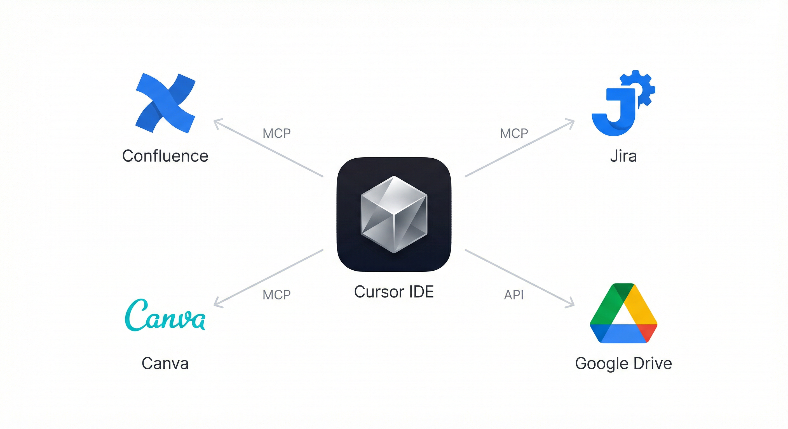

# Гайд по настройке Cursor для бизнес-системного аналитика

В гайде описано, как установить Cursor, настроить интеграции (Confluence, Jira, Google Drive, Canva и др.), как организовать папки и документацию и какие правила ведения проектов использовать, чтобы всё было понятно с первого раза.

---

## Оглавление

1. [Установка Cursor](#1-установка-cursor)
2. [Интеграции и внешние связи (MCP и API)](#2-интеграции-и-внешние-связи-mcp-и-api)
3. [Правила Cursor (`.cursor/rules`)](#3-правила-cursor-cursorrules)
4. [Структура папок и документации по типам проектов](#4-структура-папок-и-документации-по-типам-проектов)
5. [Правила ведения документации](#5-правила-ведения-документации)

---

## 1. Установка Cursor

### Что такое Cursor

**Cursor** — это IDE на базе VS Code с встроенной поддержкой AI (чат, автодополнение, агент). Для системного аналитика он удобен тем, что можно держать документацию в одном месте, править её локально и при необходимости синхронизировать с Confluence/Jira через MCP или скрипты.

### Шаги установки

1. **Скачать Cursor**  
   Официальный сайт: [cursor.com](https://cursor.com). Скачайте установщик под вашу ОС (macOS, Windows, Linux).

2. **Установить**  
   Запустите установщик и следуйте инструкциям. Cursor ставится как отдельное приложение (не поверх VS Code).

3. **Войти в аккаунт**  
   При первом запуске потребуется войти (или создать аккаунт). Подписка может быть Free или Pro — от этого зависит лимит запросов к AI и часть возможностей.

4. **Создать и открыть папку проекта**

   Cursor работает в контексте папки — это ваш проект (документация, скрипты, конфиги). Если папки проекта ещё нет, создайте её:

   **a) Создайте папку для проекта:**
   - **Где создать:** удобное место на диске, где храните рабочие проекты. Например:
     - macOS/Linux: `~/Projects/` или `~/Documents/Work Projects/`
     - Windows: `C:\Users\ВашеИмя\Projects\` или `D:\Work\`
   - **Как назвать:** по названию проекта или клиента для быстрой ориентации. Примеры:
     - `My Project` (если один основной проект)
     - `Client A Documentation` (если документация по клиенту)
     - `Team Knowledge Base` (если общая база знаний команды)
   - **Создать:** в Finder (macOS), Проводнике (Windows) или командой `mkdir "Название проекта"` в терминале.

   **b) Откройте папку в Cursor:**
   - В Cursor: **File → Open Folder** (или **Cmd+O** на macOS, **Ctrl+O** на Windows).
   - Выберите созданную папку и нажмите **Open** / **Выбрать папку**.
   - Cursor откроет проект: слева появится дерево файлов (пока пустое), справа — редактор.

   **Зачем это нужно:** все правила Cursor (`.cursor/rules`), конфиги, документация и скрипты будут лежать в этой папке. Когда вы откроете папку в Cursor, AI будет работать в контексте вашего проекта (видеть файлы, применять правила). Один раз создали папку проекта — всегда открываете её в Cursor при работе над этим проектом.

### Настройка сразу после установки: чтобы Cursor имел доступ к инструментам

Чтобы Cursor мог настраивать интеграции по команде (через промпт из setup-pack) и не упираться в отказы доступа:

1. **Всегда открывай проект папкой**  
   **File → Open Folder** — выбери папку проекта (или папку с setup-pack). Cursor должен работать в контексте этой папки: тогда он видит файлы, создаёт и правит конфиги в проекте и в `~/.cursor/`. Если открыть один файл вместо папки — доступа к остальным файлам и к настройке MCP не будет.

2. **Разрешай выполнение команд в терминале**  
   Когда Cursor предложит выполнить команду (установка uv, `pip install`, `npx` и т.д.) — разреши. Без этого MCP-серверы (mcp-atlassian, Canva и др.) и скрипты не заработают. При первом запросе Cursor может спросить разрешение на запуск терминала — нужно согласиться.

3. **Доступ к конфигам**  
   Конфиг MCP хранится в `~/.cursor/mcp.json`. Обычно Cursor имеет доступ к домашней директории и может его читать и записывать. Если на macOS появляются ошибки вида «permission denied» при записи в `~/.cursor/` или при запуске uv/npx — в **System Settings → Privacy & Security → Full Disk Access** добавь Cursor. В большинстве случаев достаточно прав по умолчанию.

4. **Порядок действий**  
   Установил Cursor → создал/открыл папку проекта → положил в неё setup-pack (или открыл папку с setup-pack) → вставил в чат промпт из `00_START_HERE.md`. Дальше настройку интеграций выполняет Cursor (создание конфигов, установка uv при необходимости); тебе остаётся только создать API-токен Atlassian, отдать данные в чат и перезапустить MCP.

После этого переходи к разделу 2 и настраивай интеграции через setup-pack.

---

## 2. Интеграции и внешние связи (MCP и API)

Часто используются такие связи:

| Инструмент        | Назначение                    | Как подключается                          |
|-------------------|-------------------------------|-------------------------------------------|
| **Confluence**    | Документация, страницы       | MCP (mcp-atlassian) + REST скрипты |
| **Jira**          | Задачи, эпики, доски         | MCP (mcp-atlassian)       |
| **Google Drive**  | Файлы, листы, документы      | Скрипты по API (например `drive_api.py`); опционально MCP  |
| **Canva**         | Презентации, дизайн          | MCP (mcp-remote → Canva)                   |

**Что такое MCP:** MCP (Model Context Protocol) — это стандарт подключения внешних инструментов к AI в Cursor. Проще: через MCP Cursor может напрямую читать/обновлять данные в сервисах (например, Confluence, Jira, Canva) из чата, без ручного копирования между окнами.

**Архитектура интеграций:**



---

### Быстрая настройка: setup-pack + один промпт

**Самый простой способ** — использовать **setup-pack**: шаблоны + один главный промпт. Cursor сам спросит, какие интеграции нужны, и настроит их.

**Как использовать:**

1. **Скачай setup-pack**  
   Скопируй папку **`setup-pack`** из репозитория с гайдом или получи архив от того, кто раздаёт гайд. Если репозитория нет — попроси у коллег папку `setup-pack` (в ней должны быть `00_START_HERE.md`, `mcp.json.template`, `env.example`, `cursor-rules/`).

2. **Распакуй в проект или открой отдельно**  
   Вариант А: положи `setup-pack` в корень своей рабочей папки (`MyProject/setup-pack/`) и открой папку проекта (**File → Open Folder** → `MyProject`).  
   Вариант Б: открой папку `setup-pack` напрямую (**File → Open Folder** → `setup-pack`).  
   **Важно:** если открыл только setup-pack — настройка пройдёт в ней; для повседневной работы потом открывай свою рабочую папку (ту, где документация и контент). Правила из `cursor-rules/` копируй в `.cursor/rules/` именно этой рабочей папки.

3. **Вставь главный промпт в Cursor**  
   Открой файл **`00_START_HERE.md`** из setup-pack, скопируй **весь** промпт (от «Ты помогаешь настроить…» до «…нужны уточнения») и вставь в **Composer** (Cmd+I / Ctrl+I) или **Agent**. Не используй обычный чат (Chat): только Composer/Agent могут создавать файлы и запускать команды в терминале. Cursor спросит, какие интеграции нужны (Confluence/Jira, Google Drive, Canva). Для Confluence+Jira Cursor проверит наличие [uv](https://docs.astral.sh/uv/) и при необходимости выполнит установку (`curl … | sh` или `brew install uv`). Если после установки uv Cursor пишет «uv: command not found» — перезапусти Cursor и повтори шаг с промптом или попроси продолжить настройку. Затем создаст конфиги (`~/.cursor/mcp.json`, при наличии `Technical/` — файл `.env`), при необходимости предложит сгенерировать скрипты Confluence по промпту из **`PROMPT_technical_scripts.md`** (в папку `Technical/` проекта; на каждом компьютере для скриптов нужен Python и `pip install -r Technical/requirements.txt`) и универсальные правила из **`setup-pack/cursor-rules/`** в `.cursor/rules/`, и выдаст чек-лист.

4. **Доделай вручную: API-ключ Atlassian и подстановка данных**  
   Cursor уже создал конфиги с плейсхолдерами. Остаётся создать API-токен в Atlassian и попросить Cursor подставить данные в конфиги.

   **4.1. Создать API-ключ в Atlassian**

   - Открой в браузере: **[Atlassian → Управление аккаунтом → Безопасность → API-токены](https://id.atlassian.com/manage-profile/security/api-tokens)**  
     (или: зайди на [id.atlassian.com](https://id.atlassian.com) → войди в аккаунт → **Profile** / **Профиль** → **Security** / **Безопасность** → **Create and manage API tokens** / **Создание и управление API-токенами**.)
   - Если кнопки создания токена нет или доступ запрещён — в компании могут быть ограничены API-токены; обратись к администратору Atlassian или работай без интеграции Confluence/Jira из Cursor.
   - Нажми **Create API token** / **Создать API-токен**.
   - В поле **Label** введи название, например: `Cursor MCP` или `Confluence Jira`.
   - Нажми **Create** / **Создать**.
   - **Сразу скопируй токен** — он показывается один раз. Сохрани его в надёжное место (менеджер паролей или временно в блокнот). Если закроешь страницу без копирования — токен придётся создавать заново.

   **4.2. Подставить данные в конфиги через Cursor**

   - Подготовь три значения:
     - **URL компании Atlassian** — адрес вашего Confluence или Jira в браузере без лишнего пути, например: `https://mycompany.atlassian.net` (для Confluence часто используется тот же домен: `https://mycompany.atlassian.net/wiki` — для MCP обычно указывают базовый `https://mycompany.atlassian.net`).
     - **Email** — тот же адрес, под которым вы входите в Atlassian (логин).
     - **API-токен** — тот, что только что скопировал.
   - Открой чат **Composer** (Cmd+I / Ctrl+I) или **Agent** в Cursor и напиши, например:

     > Обнови конфиги MCP и Technical: подставь эти данные в `~/.cursor/mcp.json` и, если есть папка Technical, в `Technical/.env`.  
     > URL: https://mycompany.atlassian.net  
     > Email: my.email@company.com  
     > API-токен: скопированный_токен_сюда

     Вставляй **свои** URL, email и токен (не оставляй пример «скопированный_токен_сюда»), без лишних пробелов в начале и конце строк. Cursor обновит `~/.cursor/mcp.json` (блок `mcp-atlassian`) и при наличии папки `Technical/` — файл `Technical/.env`.  
   - После подстановки перезапусти MCP: **Settings → Features → MCP → Restart Servers**. Если в настройках не находишь этот раздел — перезапусти приложение Cursor целиком.  
   - Если при создании или обновлении конфигов появилась ошибка доступа к файлам («permission denied») — см. раздел **«Настройка сразу после установки»**, пункт «Доступ к конфигам».

   **4.3. Проверка**  
   В **Settings → MCP** серверы должны быть зелёными. В чате спроси: «Найди в Jira открытые задачи» или «Покажи страницу Confluence [название]» — если ответ пришёл, интеграция работает.

**Готово.** Интеграции настроены.

---

---

**Справочно — откуда взять MCP и API:** [mcp-atlassian (GitHub)](https://github.com/sooperset/mcp-atlassian) · [Confluence REST API](https://developer.atlassian.com/cloud/confluence/rest/v2/) · [Google Drive API v3](https://developers.google.com/drive/api/reference/rest/v3) · [Canva MCP](https://mcp.canva.com/mcp)

---

### 2.1. Контекст Confluence в проекте (space keys, page IDs)

Чтобы AI и скрипты знали, куда писать и откуда читать, в проектах заводится **контекстный файл**:

- В папке `Technical/` создают файл **`CONFLUENCE_CONTEXT.md`** с базовым URL, ключами спейсов, page ID ключевых страниц и ссылками на Confluence. При смене инстанса или страниц файл обновляют.
- Page ID конкретных страниц можно дополнительно зафиксировать в правилах или в `Technical/README.md`.

Рекомендация: в любом проекте, где есть Confluence, завести один такой файл (или раздел в README) с базовым URL, спейсами и ключевыми page ID.

---

## 3. Правила Cursor (`.cursor/rules`)

Правила — это файлы в папке **`.cursor/rules/`** с расширением **`.mdc`**. Они подсказывают AI, как вести себя в этом проекте: какой MCP использовать, что не редактировать, как оформлять документы.

### Формат файла правила

В начале файла — YAML frontmatter:

```yaml
---
description: Краткое описание правила (видно в списке правил)
alwaysApply: true   # применять всегда в этом проекте
globs: "SI Source Material/**"   # опционально: только для указанных путей
---
```

Дальше идёт текст в Markdown: заголовки, списки, таблицы.

### Правила из setup-pack

В **setup-pack** в папке **`cursor-rules/`** лежит одно универсальное правило — его можно скопировать в `.cursor/rules/` своего проекта:

| Файл в setup-pack       | Описание |
|-------------------------|----------|
| **mcp-integrations.mdc** | MCP и интеграции (Confluence, Jira): локально-first, Confluence как источник истины, когда использовать MCP, когда скрипты из `Technical/`, проверка конфликтов (комментарии, changelog), вложения через скрипты, контекст проекта (CONFLUENCE_CONTEXT.md). Без привязки к конкретным спейсам или проектам. |

Скопируй файлы из `setup-pack/cursor-rules/` в **`.cursor/rules/`** той папки, которую ты будешь открывать в Cursor для повседневной работы (документация, контент). Если сейчас открыт только setup-pack — создай папку `.cursor/rules/` в своей рабочей папке проекта и скопируй туда; иначе правила не будут применяться, когда откроешь другой каталог.

**Как попросить Cursor создать или дополнить правила**

Вместо ручного создания файлов можно дать задание в чате (Composer или Agent). Примеры формулировок:

- **Правила для Confluence/Jira:**  
  *«Создай папку `.cursor/rules/`, скопируй в неё правило из `setup-pack/cursor-rules/mcp-integrations.mdc` (или создай правило для MCP и Confluence/Jira по этому образцу)».*

- **Папка «только чтение»:**  
  *«Добавь правило: папка `Source Material/` (или `Исходники/`) — только чтение, не редактировать. Итоговый контент в папке `Documentation/` (или укажи свою). Сохрани в `.cursor/rules/` с globs на эту папку».*

- **Стиль презентаций:**  
  *«Добавь правило в `.cursor/rules/`: стандарт оформления презентаций — шрифты Object Sans / Inter, цвета и стиль нашей команды, чек-лист перед финализацией. Опиши в .mdc».*

Cursor создаст или обновит файлы в `.cursor/rules/`; при необходимости уточни пути папок или названия под свой проект.

---

## 4. Структура папок и документации по типам проектов

Ниже — типовые структуры проектов. Их можно использовать как шаблон.

### 4.1. Проект с документацией и Confluence

```
Project/
├── .cursor/
│   └── rules/                 # Правила для Cursor (MCP, Confluence и т.д.)
├── Documentation/             # Документация: обзоры, спецификации, отчёты
│   ├── Overview.md
│   └── ...
├── Source Materials/         # Исходники (read-only): расшифровки, заметки, входящие доки
│   └── ...
├── Resources/                 # Ресурсы, которые не меняются: шаблоны, справочники
│   └── ...
├── Graphics/                  # Графики, диаграммы, картинки для документов
│   └── ...
└── Technical/                 # Всё техническое: скрипты Confluence, .env, README
    ├── README.md
    ├── .env
    ├── upload_confluence_attachment.py
    └── ...
```

- **Documentation** — рабочие документы, которые правишь и при необходимости публикуешь в Confluence.  
- **Source Materials** — только чтение (расшифровки, заметки, входящие материалы); итоговый контент — в Documentation.  
- **Resources** — только чтение (шаблоны, эталоны).  
- **Graphics** — картинки для вставки в документы и в Confluence; скрипты загрузки — в `Technical/`.  
- **Technical** — конфиги, скрипты, описание, как публиковать с картинками.

---

### 4.2. Проект с обзором бизнеса и процессами

```
BusinessDoc/
├── Business_Overview_and_Processes_Documentation.md   # Итоговый документ
├── Source Material/
│   ├── Transcript_*.txt
│   └── ...
└── .git
```

- Один основной артефакт — большой markdown-документ. Исходники в `Source Material/` — только для справки. Можно добавить правило source-material.mdc.

---

### 4.3. Проект с фазами MVP и исходниками

```
MVPProject/
├── MVP phase 1/
│   ├── Feature_Requirements.md
│   ├── MVP_Overview.md
│   └── ...
├── MVP phase 2/
├── Source Materials MVP phase 1/
│   ├── Input docs/
│   └── ...
└── Source Materials MVP phase 2/
```

- Документация по фазам в отдельных папках; исходные материалы (встречи, доки) — в соответствующих «Source Materials» папках. Удобно завести README в корне и при необходимости правила на «Source Materials» как read-only.

---

### 4.4. Утилитарный проект (скрипты + данные)

- Скрипты (например транскрипция, конвертация), `requirements.txt`, папка с исходными файлами и результатами. Правила Cursor опциональны.  
- Справочные материалы (доки, примеры) — при необходимости README и правило по стилю или структуре.

---

## 5. Правила ведения документации

### Бизнес-процесс работы с документацией

```
  Исходники              Локальная работа         Проверка              Публикация
  (read-only)            (черновики в .md)        (комментарии)         (по запросу)

  ┌──────────┐      ┌──────────┐      ┌──────────┐      ┌──────────┐
  │ Встречи, │ ───▶ │ Правки и │ ───▶ │ Проверить│ ───▶ │ Confluence│
  │ заметки, │      │ дополн.  │      │ страницу │      │ + Jira   │
  │ доки     │      │ в .md    │      │ и коммент.│     │ (синк)   │
  └──────────┘      └──────────┘      └──────────┘      └──────────┘
```

**Кратко:** исходники только читаем → правим локально → перед публикацией проверяем Confluence → публикуем по запросу → держим Jira и Confluence в синхронизации.

---

Сводка правил, которые повторяются в проектах:

### 5.1. Локально-first vs источник истины в Confluence

- **Локально-first:** черновики и правки делаются в репозитории (в `.md` файлах). Confluence обновляется только по явному запросу («опубликовать», «синхронизировать»).
- **Источник истины опубликованного:** Confluence. Перед обновлением страницы в Confluence всегда один раз получить текущее содержимое (MCP `confluence_get_page`) и при необходимости комментарии (`confluence_get_comments`), чтобы не перезаписать ручные правки.

### 5.2. Source Material — только чтение

- Папки с расшифровками, заметками, входящими доками — **не редактировать** и не удалять без явного запроса.  
- Итоговый контент живёт в рабочих папках (SI/, DI/, Documentation/, MVP phase 1/2 и т.д.) и при необходимости в Confluence.

### 5.3. Конфликты: сообщать пользователю

- Перед правкой страницы в Confluence проверять комментарии. Если есть обсуждение того же блока или альтернативные формулировки — сообщить пользователю и не перезаписывать без подтверждения.
- Аналогично для Jira: при изменении полей проверять changelog/комментарии и сообщать о возможных конфликтах.

### 5.4. Вложения Confluence

- Список/загрузка/вставка в текст/удаление — предпочтительно через **скрипты** из `Technical/`, а не через MCP, чтобы не тянуть большие объёмы в чат. Команды описать в README или в `Technical/README.md`.  
- **Важно:** скрипты — это Python. На каждом компьютере, где их запускают, нужны установленный [Python](https://www.python.org/downloads/) и зависимости: `pip install -r Technical/requirements.txt`. Без Python скрипты не работают. Если Python не ставить — вложения в Confluence загружают вручную через веб-интерфейс.

### 5.5. Синхронизация Jira и Confluence (если применимо)

- В страницах инициатив в Confluence — таблица экшн-айтемов с колонкой **Jira** (ссылки на задачи). При создании новой задачи в Jira по инициативе — добавить в таблицу в Confluence строку с ссылкой на задачу. Маппинг Epic → Confluence page ID хранить в правилах или в CONFLUENCE_CONTEXT.

